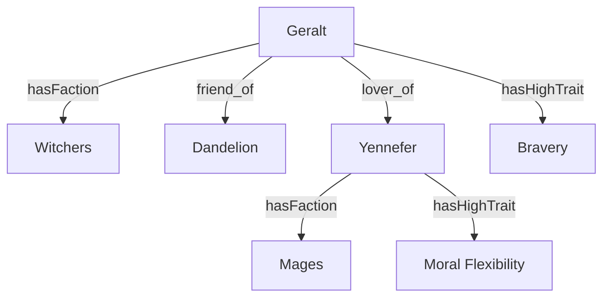

# Witcher Character Quiz

<div class="pt-12 text-3xl italic opacity-80">
  Who are you in the Continent?
</div>

<div class="abs-bl m-6 flex gap-2">
  <div class="text-sm opacity-50">
    Character Matching Project
  </div>
</div>

<!--
Welcome everyone. Today we are presenting our Witcher Character Quiz project.
This isn't just a simple Buzzfeed-style quiz; it's a structural exploration of character traits and relationships using graph embeddings.
-->

---
layout: default
---

# What is this project?

The Witcher Character Quiz is a structured groundwork for an intelligent character matching system.

<v-clicks>

- **Domain Modeling**: Curating characters, factions, and traits from the Witcher universe.
- **Knowledge Graph**: Building a unified representation of relationships and attributes.
- **Hybrid Embeddings**: Combining structural graph data with raw trait values.
- **Matching Algorithm**: Using cosine similarity in a shared latent space.

</v-clicks>

<br>

<div v-click class="p-4 bg-slate-800 rounded-lg border border-slate-700">
  <div class="text-amber-400 font-bold mb-2">Goal</div>
  To connect qualitative questionnaire responses with quantitative character embeddings for highly accurate matching.
</div>

---
layout: image-right
image: https://images.unsplash.com/photo-1533134486753-c833f0ed4866?q=80&w=2070&auto=format&fit=crop
---

# Domain Modeling
The foundation.

<v-clicks>

- **14 Trait Dimensions**
  - Openness, Conscientiousness, Bravery, Moral Flexibility, etc.
- **Characters**
  - Geralt, Ciri, Yennefer, Triss, Vesemir, Dandelion.
- **Factions**
  - Witchers, Mages, Commoners, Nobility.
- **Data Source**
  - Structured `JSON-LD` containing trait vectors and social relations.

</v-clicks>

---

# Knowledge Graph (HRAP)
**H**ybrid **R**epresentation of **A**ttributes and **P**ersonality.

<div class="grid grid-cols-2 mt-10">

<div>
<v-clicks>

- **Nodes**:
  - `Character`
  - `Faction`
  - `Trait`
- **Edges**:
  - `friend_of`, `lover_of`
  - `hasHighTrait` (≥ 0.7)

</v-clicks>
</div>

<div v-click class="flex items-center">

</div>

</div>

---

# Implementation: Graph Construction
Building the `NetworkX` representation.

```python {all|7-8|16-17|20-22|all}
# domain/graph_builder.py

def build(self) -> nx.Graph:
    self.data = load_jsonld(self.jsonld_path)
    self.graph = nx.Graph()

    for character in extract_characters(self.data):
        self.graph.add_node(character["id"], type="Character", ...)
    
    # ... add Faction and Trait nodes ...

    for character in extract_characters(self.data):
        char_id = character["id"]
        
        # Add Social Relations
        for rel in character.get("relation", []):
            self.graph.add_edge(char_id, rel["target"], relation_type=rel["type"])

        # Add High Trait Edges (Threshold 0.7)
        for trait_id, value in character.get("traitValues", {}).items():
            if value >= self.trait_threshold:
                self.graph.add_edge(char_id, trait_id, relation_type="hasHighTrait")
```

---

# Hybrid Embedding Strategy
Fusing Structure and Attributes.

<v-clicks>

1. **Structural Embedding (Node2Vec)**: **32 Dimensions**.
2. **Attribute Vector (Raw Traits)**: **14 Dimensions**.
3. **Hybrid Concatenation**: **46D Unified Space**.

</v-clicks>

<div v-click class="mt-8">
<div class="flex justify-center items-center gap-4 text-2xl font-mono">
  <div class="px-4 py-2 bg-blue-900/50 rounded">Graph (32D)</div>
  <div class="text-2xl">+</div>
  <div class="px-4 py-2 bg-amber-900/50 rounded">Traits (14D)</div>
  <div class="text-2xl">=</div>
  <div class="px-4 py-2 border-2 border-amber-500 rounded text-amber-500">Hybrid (46D)</div>
</div>
</div>

---
layout: center
---

# Questionnaire Design

<v-clicks>

- **12 Story-Driven Questions**: "When making decisions... what guides you?"
- **Answer-to-Trait Mapping**: Weighted scores per dimension.
- **Normalization**: Aggregated to a 14D User Trait Vector.

</v-clicks>

---

# Implementation: User Embedding

```python {all|5-10|15-16|all}
# embeddings/user_embedding_builder.py

def build_user_embedding(self, user_traits: np.ndarray) -> np.ndarray:
    # 1. Structural Portion (32D)
    graph_portion = np.zeros(32)
    for i, trait_name in enumerate(TRAIT_ORDER):
        weight = user_traits[i]
        trait_node_id = f"wc:{trait_name}"
        if trait_node_id in self.node_embeddings:
            graph_portion += weight * self.node_embeddings[trait_node_id]
            
    # 2. Attribute Portion (14D)
    attribute_portion = user_traits
    
    # 3. Concatenate and Normalize
    hybrid = np.concatenate([attribute_portion, graph_portion])
    return hybrid / np.linalg.norm(hybrid)
```

---

# The Matching Engine
Cosine Similarity in 46D.

<div class="grid grid-cols-2 gap-4">

<div>
<v-clicks>

- **Process**:
  1. Transform answers to 14D Vector.
  2. Map to 46D Hybrid Embedding.
  3. Calculate similarity vs Characters.
- **Why this works?**
  - Considers both personality and world-context.

</v-clicks>
</div>

<div v-click class="p-4 bg-slate-800 rounded shadow-xl">
  <div class="text-sm font-bold text-amber-500 mb-2">Mathematical Formulation</div>
  
  $$similarity = \frac{\mathbf{x} \cdot \mathbf{y}}{\|\mathbf{x}\| \|\mathbf{y}\|}$$

  <div class="text-xs opacity-60 mt-2 italic">
    Similarity between User vector x and Character vector y.
  </div>
</div>

</div>

---

# Project Demo
The end-to-end flow.

<div class="flex flex-col items-center justify-center h-full">

  <div class="w-2/3 p-4 bg-black rounded shadow-2xl border border-slate-700 font-mono text-sm">
    <div class="text-green-400 mb-2">> python main.py</div>
    <div class="text-white">
      1. When making decisions... [Intuition / Logic / Moral]<br>
      2. How do you respond to pressure...<br>
      ...<br>
      <span class="text-amber-500 font-bold">Matching Complete.</span><br>
      Top Result: <span class="text-amber-400 font-bold italic">Geralt of Rivia</span> (Score: 0.942)<br>
      "You value pragmatism and resilience, mirroring Geralt's life as a Witcher."
    </div>
  </div>

</div>

---

# Analysis & Visualization
Verifying structural separation.

<div class="grid grid-cols-2 gap-4">

<v-clicks>

- **High-Dimensional Latent Space**
  - 46D vectors capture subtle differences.
- **Distinct Character Embeddings**
  - UMAP reveals clear separation between characters.
- **Meaningful Distance**
  - Visual distance correlates to personality differences.

</v-clicks>

<div v-click class="flex flex-col items-center">
  
  <div class="text-sm opacity-60 text-center mt-2">Character Separation (UMAP)</div>
</div>

</div>

---
layout: center
class: text-center
---

# Conclusion

<v-clicks>

- **Scalability**: New characters via JSON-LD.
- **Context-Aware**: Graph relations improve matching.
- **Next Steps**: Adding descriptions to characters

</v-clicks>

<div v-click class="mt-12 text-3xl font-bold text-amber-500">
  Thank You!
</div>

<div v-click class="text-lg opacity-60">
  Questions?
</div>
